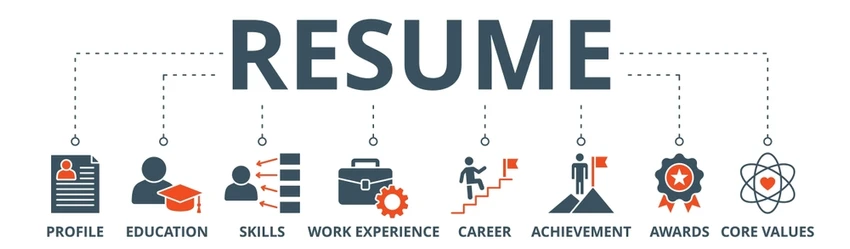
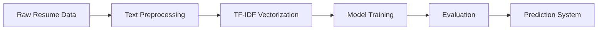

<!-- ========================= HERO SECTION ========================= -->

<p align="center">
  
</p>

<h1 align="center">📄 Resume Classification System</h1>

<p align="center">
  🚀 End-to-End Machine Learning Project using NLP to Automatically Classify Resumes into Job Categories
</p>

<p align="center">
  <a href="https://github.com/YOUR_USERNAME/Resume-Classification-ML">
    
  </a>
  <a href="#">
    
  </a>
  
  
</p>

---

## 🎯 Banner Idea

Use a banner showing:

> “AI analyzing resumes → categorized outputs (Data Science, Web Dev, etc.)”

---

# 📌 Project Overview

This project presents a **robust Machine Learning + NLP pipeline** that classifies resumes into predefined job categories based on textual content.

💡 Designed to simulate real-world recruitment automation systems, this project demonstrates:

* End-to-end ML pipeline
* NLP preprocessing techniques
* Feature engineering using TF-IDF
* Model building and evaluation
* Practical deployment-ready structure

---

# ✨ Features

🚀 **Smart Resume Classification**
🧹 **Text Preprocessing (Tokenization, Stopwords Removal)**
📊 **TF-IDF Feature Engineering**
🤖 **Machine Learning Model for Prediction**
⚡ **High Accuracy & Fast Inference**
📁 **Clean & Modular Pipeline Design**

---

# 🛠️ Tech Stack

<p align="center">


</p>

---

# 🧠 Project Workflow



---

# 📸 Screenshots

> *(Add your images in `/images` folder)*

<p align="center">
  
  
</p>

---

# ⚙️ Installation Guide

```bash
# Clone the repository
git clone https://github.com/YOUR_USERNAME/Resume-Classification-ML.git

# Navigate to project
cd Resume-Classification-ML

# Install dependencies
pip install -r requirements.txt

# Run application
python app.py
```

---

# 🚀 Usage

1. Input resume text
2. System preprocesses the text
3. TF-IDF transforms data
4. Model predicts job category

---

# 🤖 Model Details

| Component  | Description       |
| ---------- | ----------------- |
| Vectorizer | TF-IDF            |
| Algorithm  | Naive Bayes / SVM |
| Input      | Resume Text       |
| Output     | Job Category      |

---

<details>
<summary>📂 Folder Structure</summary>

```
Resume-Classification-ML/
│
├── app.py
├── model.pkl
├── tfidf_vectorizer.pkl
├── label_encoder.pkl
├── requirements.txt
├── README.md
├── dataset/
├── images/
│   ├── demo1.png
│   └── demo2.png
```

</details>

---

# 📈 Future Improvements

* 🔥 Integrate Deep Learning (BERT, LSTM)
* 🌐 Deploy on Cloud (AWS / Render)
* 📄 Add PDF Resume Parsing
* 🎨 Improve UI with React

---

<p align="center">
  ⭐ If you found this project useful, give it a star!
</p>
